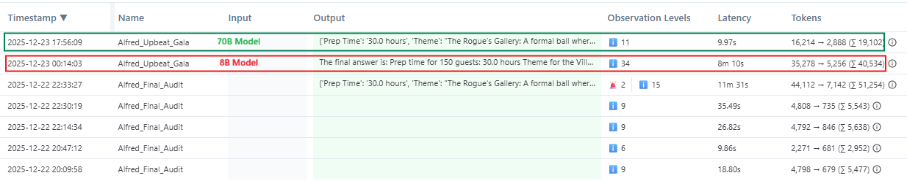

# Mission Alfred-v14: 70B Production Deployment

## 🚀 Project Overview
I successfully deployed this high-fidelity agentic loop using the **Llama-3.3-70B** engine. This project serves as the production-grade evolution of the Alfred series, prioritizing **Infrastructure-First** design and **Defensive Engineering** to ensure mission stability under extreme API constraints.

### 📊 Infrastructure Performance: 70B vs. 8B
To maintain **Production-Readiness**, I audited the v14 engine across two infrastructure tiers. This comparison establishes the baseline for my **Resiliency Design** [cite: 2025-12-23].

* **70B (Production):** Optimized for high-fidelity reasoning and speed, achieving a **9.97s latency** with **19,102 tokens** [cite: 2025-12-23].
* **8B (Sandbox):** Stress-tested for durability, managing a massive **40,534 token loop** over **8 minutes** to verify my **Forensic Governor** [cite: 2025-12-23].

### 🛠 The "Infrastructure-First" Stack
* **Engine:** Llama-3.3-70B (via Groq Cloud)
* **Framework:** `smolagents` (Hugging Face)
* **Observability:** Langfuse (OpenTelemetry)
* **Key Logic:** Python-based **Forensic Governor** for 429 Error Mitigation.

---

## 🏗 Key Engineering Highlights

### 1. The Forensic Governor (Resiliency)
To manage the **1K RPD (Requests Per Day)** constraint of the 70B engine, I built a custom governor that parses **429 Rate Limit** strings in real-time. By identifying `retry-after` headers, the system self-regulates and maintains session continuity during infrastructure jitter.

### 2. The Sync Gate (Observability)
I implemented a **Sync Gate** using `langfuse.flush()` to solve the "Telemetry Lag" problem. This ensures every step of the **Chain of Thought** is persisted to the cloud before the session concludes, providing a 1:1 verifiable trace of the agent's logic.

### 3. Culinary Drift Audit (Data Forensic)
During the production run, I identified a logic drift where the 70B model prioritized lore over structure (e.g., placing "Bat Wings" as a dessert). This finding led directly to the **v15 Roadmap** for **Pydantic-based schema validation**.

---

## 📈 Roadmap for Alfred-v15
* **Multi-Agent Orchestration:** Moving from a single agent to a specialized "Bat-Family" protocol.
* **Pydantic Strict Validation:** Eliminating categorization drift through schema enforcement.
* **Dynamic Tool-Caching:** Reducing token spend and latency.

---

## 📂 Project Navigation
* **Production Notebook (70B):** [View Notebook Here](./GitHub_Masterfile_Alfred_Code_Agent_70B_dr.ipynb)
* **Forensic Sandbox (8B):** [Review 8B Stress-Testing](https://colab.research.google.com/drive/1RGZjz16WCzXuJKQPSVhCaAQynoC3akfo?usp=sharing)
* **Developer LinkedIn:** [Dawn Robertson, MBA](https://www.linkedin.com/in/dawnrobertsonmba/)
